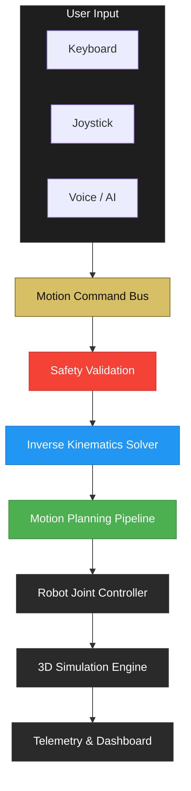

# Clove Arm

**Live Link**: [https://clove-arm.vercel.app/](https://clove-arm.vercel.app/)

Developed by **Team Clover**:

| Name                      | University              | GitHub / Portfolio                                     |
| :------------------------ | :---------------------- | :----------------------------------------------------- |
| **Sadman Islam**          | Metropolitan University | [GitHub: amisadman](https://github.com/amisadman)      |
| **Shah Samin Yasar**      | Metropolitan University | [Portfolio](https://shahsaminyasar.vercel.app/)        |
| **Ahmed Thousif Thisham** | Metropolitan University | [Portfolio](https://ahmedthousifportfolio.vercel.app/) |

---

> **A browser-based 6-DOF robotic arm simulation and control platform built for the Vantage Robotics Final Round Hackathon.**

Clove Arm is a complete robotic arm simulation that enables engineers to visualize, manually control, validate, and autonomously operate a 6-DOF industrial robotic arm entirely inside a web browser.

Instead of testing experimental control software on expensive physical hardware, Clove Arm provides a safe simulation environment where every motion passes through the same deterministic control pipeline before execution.

---

# Overview

The project recreates the complete workflow expected by **Vantage Robotics**, allowing users to:

- Visualize the robotic arm in real-time
- Control the arm using multiple input methods
- Compute inverse kinematics for target positions
- Validate every movement using safety checks
- Execute autonomous PIN-entry sequences
- Interact using voice commands
- Control the arm using natural language through an AI-powered reasoning layer

The entire application is built around **one unified motion pipeline**, ensuring that every control method behaves consistently and safely.

---

# Project Goals

The project satisfies **all required phases** of the hackathon problem statement and implements the **optional Agentic Voice Control extension**.

### Phase 1 — Visualization

- Load and render the provided URDF robot model
- Live 3D visualization
- Real-time joint telemetry
- End-effector position tracking
- Rendered 6-key test panel from `key.config.json`

---

### Phase 2 — Manual Control

Multiple control methods share the exact same motion pipeline.

- Joint sliders
- GUI joystick
- Keyboard controls
- Target position movement using IK

---

### Phase 3 — Voice Control

Voice commands can control the robotic arm, including movement and rotation commands such as:

- Move up
- Move down
- Move left
- Move right
- Rotate base
- Move to target

All recognized commands are translated into structured robot actions before execution.

---

### Phase 3B — Agentic Voice Control (Bonus)

Natural language instructions are interpreted using an LLM-powered reasoning layer.

Examples:

> "Move slightly above key 5 and press it twice."

> "Rotate the base 20 degrees then move toward the keypad."

The reasoning layer:

- understands free-form instructions
- converts them into structured robot commands
- validates every generated action
- explains failures naturally
- optionally provides spoken feedback

Every AI-generated action still passes through deterministic safety validation before execution.

---

### Phase 4 — Autonomous PIN Entry

Given a 6-digit PIN, the robot:

1. Computes target coordinates
2. Plans the motion
3. Moves above each key
4. Performs a downward touch
5. Verifies successful key presses
6. Continues until the PIN is complete

No hardcoded animations are used—every movement follows the same motion pipeline used by manual control.

---

### Phase 5 — Electrical Schematic

**Wokwi Link** : https://wokwi.com/projects/469131631081158657

The project includes a proof-of-concept electrical design illustrating:

- Servo motors
- Driver stage
- Microcontroller
- Power delivery
- Wi-Fi communication
- Overall system architecture

---

# Architecture



Every interaction uses the same deterministic pipeline.

# Features

## 3D Simulation

- URDF robot rendering
- Interactive orbit camera
- Grid and floor
- Live animation
- Keypad visualization

---

## Motion Control

- Forward kinematics
- Inverse kinematics
- Jacobian solver
- Damped Least Squares IK
- Motion interpolation
- Smooth trajectories

---

## Manual Controls

- GUI joystick
- Keyboard movement
- Joint sliders
- Target movement

---

## Voice Controls

- Speech recognition
- Command parsing
- Motion execution
- Spoken feedback

---

## Agentic AI

- Natural language understanding
- Multi-step reasoning
- Command generation
- Safety-aware execution
- Conversational feedback

---

## Autonomous Tasks

- PIN input
- Motion sequencing
- Touch validation
- Automated execution

---

## Safety System

Every command—manual, scripted, voice, or AI-generated—passes through the same safety layer.

Safety validation includes:

- Workspace bounds
- Reachability checks
- Joint limit validation
- Motion constraints
- Invalid command rejection

---

# Tech Stack

### Frontend

- React
- TypeScript
- Vite

### 3D Rendering

- Three.js
- React Three Fiber
- Drei
- URDF Loader

### Robotics

- Forward Kinematics
- Inverse Kinematics
- Jacobian-based IK
- Damped Least Squares Solver

### AI & Voice

- Speech Recognition API
- LLM-powered reasoning
- Text-to-Speech

---

# ▶ Getting Started

Clone the repository

```bash
git clone https://github.com/amisadman/clove-arm.git
```

Install dependencies

```bash
cd client
npm install
```

Run the development server

```bash
npm run dev
```

Open the URL shown by Vite.

---

# Usage

You can control the robotic arm using:

- Joint sliders
- GUI joystick
- Keyboard
- Voice commands
- Natural language (Agentic AI)
- Autonomous PIN entry

All control methods share the same motion pipeline and safety validation.

---

# Safety First

The project follows a deterministic control architecture.

Every requested movement is validated before execution.

Commands that violate:

- workspace boundaries
- joint limits
- reachability constraints
- malformed AI outputs

are rejected safely.

---

# Hackathon Deliverables

- Browser-based 6-DOF robotic arm simulation
- URDF visualization
- Dashboard with live telemetry
- Inverse kinematics
- GUI joystick control
- Keyboard control
- Voice control
- Autonomous PIN entry
- Electrical schematic
- Agentic natural language voice control (Bonus)

---
